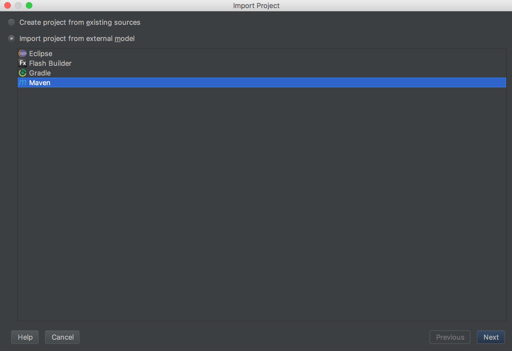
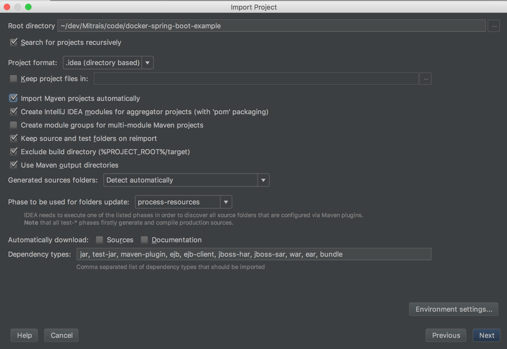
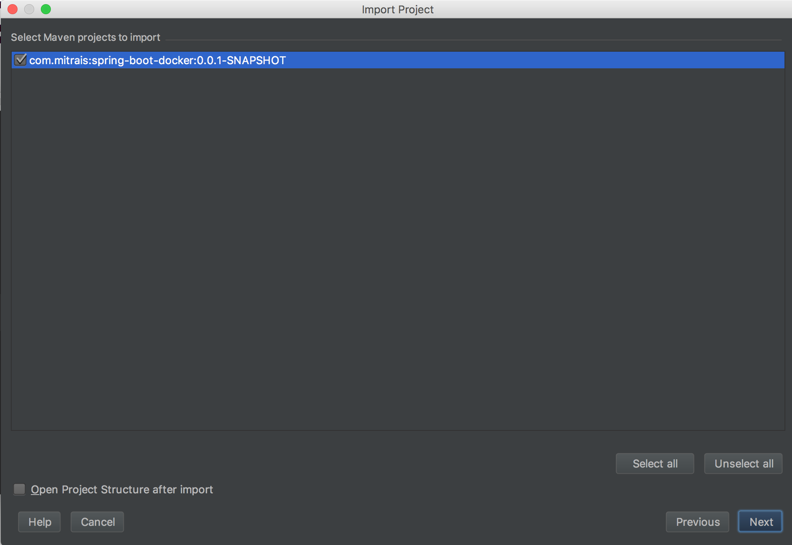
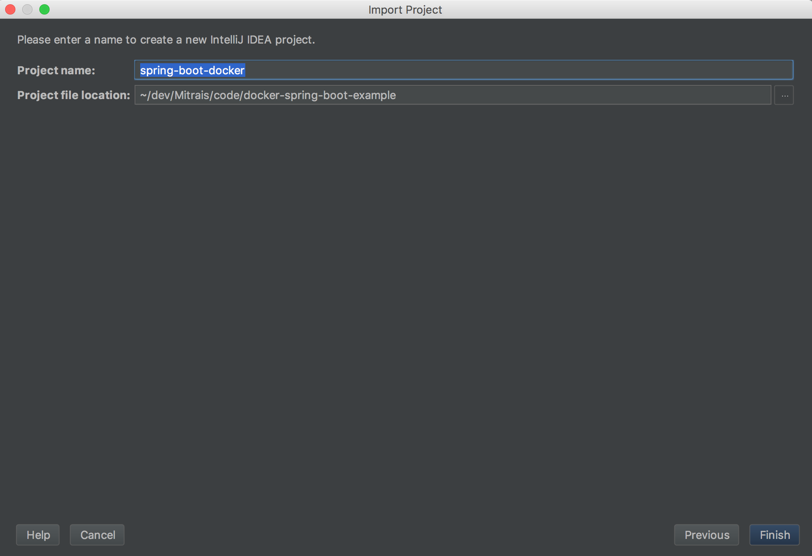
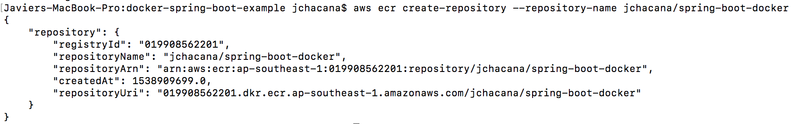
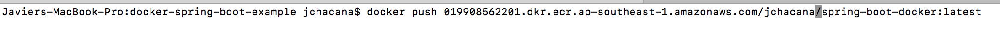
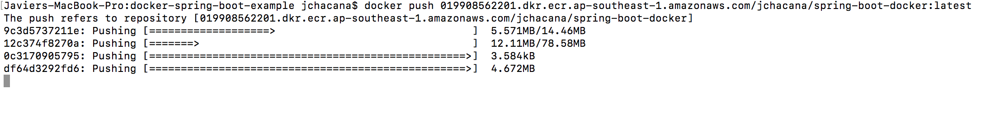
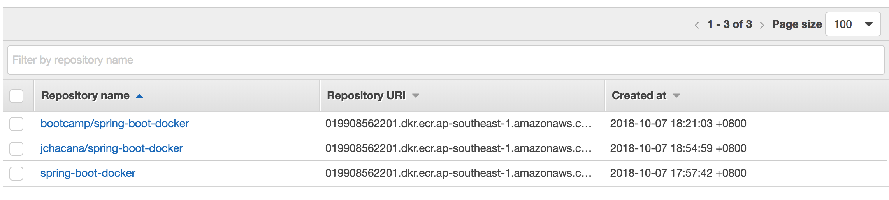
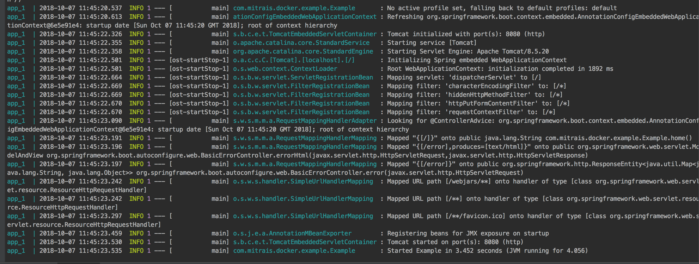
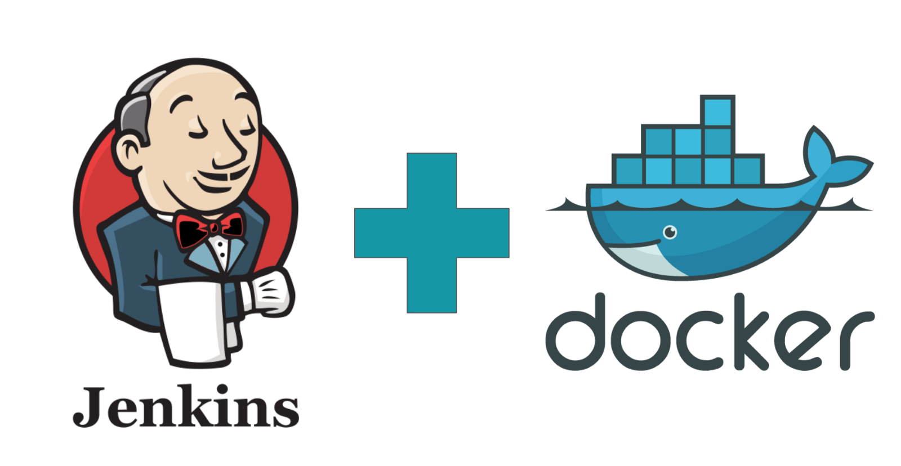

# Docker application deployed on AWS (with CI integration)

---

## Requirements

 - Java 8
 - Maven
 - Git
 - Compatible IDE (IntelliJ or Eclipse)
 - Docker CE

---

## Step 1
Go to [this repo](https://github.com/jchacana/spring-boot-docker-demo), clone it with your favorite git tool, either a graphical git client or **CLI**

---

## Step 2 (IntelliJ based)

 - Click on **Import project**
 <!-- .element: height="400px" -->

---

## Step 3 (IntelliJ based)

 - Select **Import project from external model** then **Maven**
  <!-- .element: height="400px" -->

---

## Step 4 (IntelliJ based)

 - Select the root folder for your project (keep the same location as where you cloned)
 - In the next screen, select profile if applies to your local settings (this will depend on your maven settings, which is out of scope)
  <!-- .element: height="400px" -->

---

## Step 5 (IntelliJ based)

 - Confirm import of module
  <!-- .element: height="400px" -->

---

## Step 6 (IntelliJ based)

 - Confirm project name and location. Press **Finish** and wait for project to be fully imported
 <!-- .element: height="400px" -->

---

## Step 7
 - Follow README.md file to compile, build and test
 - If you've executed every step, ee now have a local docker image ready to be run and tested

---

## Step 8.1 (Optional, assumes AWS CLI and Docker)

Make sure you have AWS CLI and configure your credentials for AWS and Docker

 - `` aws configure ``
 - `` $(aws ecr get-login --no-include-email --region ap-southeast-1) ``
    + This command will store your credentials info in ~/.docker/docker.json

---

## Step 8.2 (assumes AWS already set)
We go and create a new Docker image repository on AWS Elastic Container Registry (ECR) service

 - `` aws ecr create-repository --repository-name <your_username>/spring-boot-docker ``
 - You'll find useful info in the output
 <!-- .element: height="250px" -->

---

## Step 9
We'll re create our image with the data from our recently created repository:
 - Go to **pom.xml** file
    - Replace **docker.image.prefix** value with **repositoryUri** obtained when we created the repository
 - It should look like this
    - `` <docker.image.prefix>019908562201.dkr.ecr.ap-southeast-1.amazonaws.com/<your_username></docker.image.prefix>  ``
 - Re run `` mvn dockerfile:build ``

---

## Step 10
Now we'll push our image to our AWS ECR repository
- `` docker push 019908562201.dkr.ecr.ap-southeast-1.amazonaws.com/<your_user>/spring-boot-docker:latest ``
 <!-- .element: height="50px" -->
 <!-- .element: height="150px" -->

---

## Step 11
We check on AWS ECR. 
 <!-- .element: height="350px" -->

---

## Step 12
Now, we'll delete our original image and test our newly uploaded image
 - `` docker image ls `` to get our image list. Identify your image, copy the image id
 - `` docker image rm <image_id>`` to delete the image. Add ``-f` if force is needed

---

## Step 13
Go to **docker-compose.yml** and replace `` image `` value with your image. It should look like:
`` image: 019908562201.dkr.ecr.ap-southeast-1.amazonaws.com/<your_user>/spring-boot-docker:latest ``

---

## Step 14
Test everything with `` docker-compose up ``. Your docker app should be up and running
 <!-- .element: height="350px" -->

---

# Integrate with CI

---

The following section will cover the creation of a CI server on AWS. This server will be OK for testing purposes. For a production-ready, you'll probably want to implement some security measures and more complex workflows.
For that, take a look at this [AWS Jenkins Whitepaper](https://d0.awsstatic.com/whitepapers/DevOps/Jenkins_on_AWS.pdf)

---
## Jenkins CI
 <!-- .element: height="350px" -->

---
## Setting up a Jenkins instance on AWS
**A couple of assumptions**
 - Previous knowledge and AWS account correctly configured
 - Previous knowledge on how to create an EC2 instance
 - Previous knowledge on how to connect to the instance via SSH and HTTP
 - AWS Security groups and rules correctly configured

---

## Step 1

