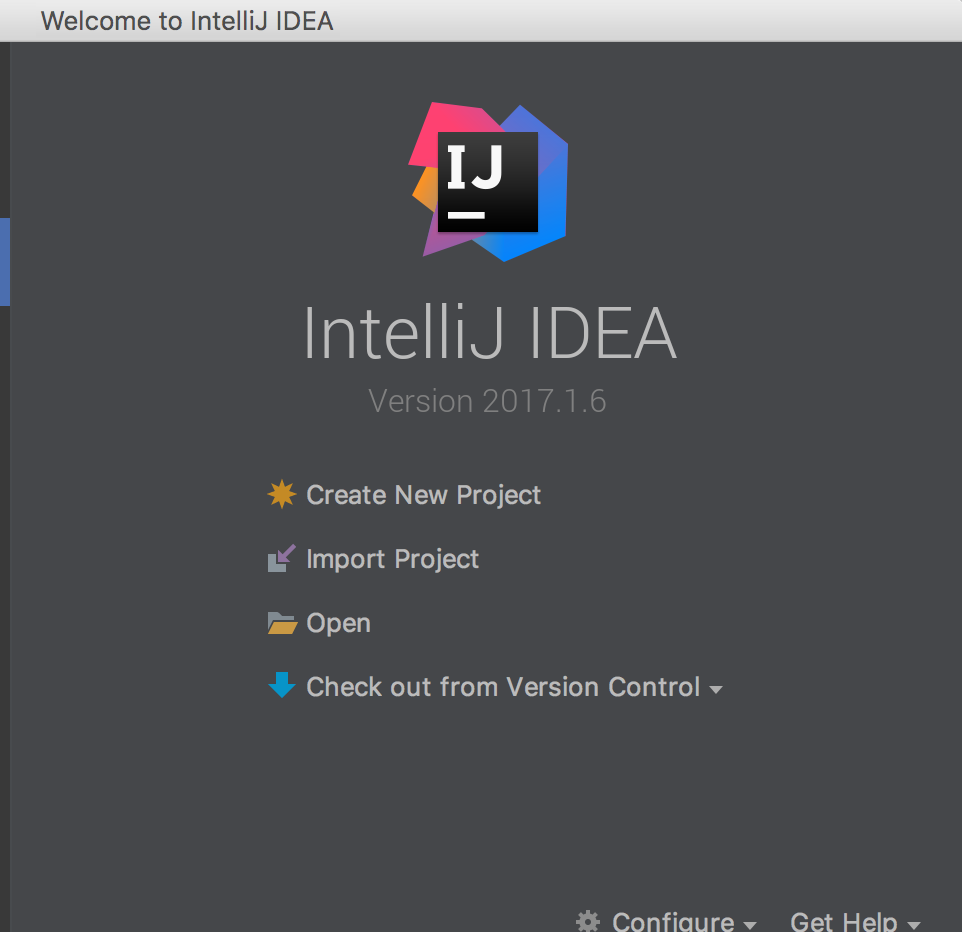
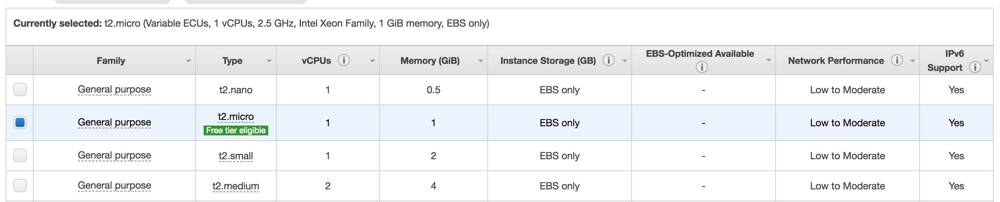

# Docker application deployed on AWS (with CI integration)

---

## Requirements

 - Java 8 (For optional steps)
 - Maven (For optional steps)
 - Git
 - Compatible IDE (IntelliJ or Eclipse for optional steps)
 - Docker CE

---

# The following steps, 1 to 7 are optional

---

## Step 1 (IntelliJ based)
Go to [this repo](https://github.com/jchacana/spring-boot-docker-demo), clone it with your favorite git tool, either a graphical git client or **CLI**

---

## Step 2 (IntelliJ based)

 - Click on **Import project**
 <!-- .element: height="400px" -->

---

## Step 3 (IntelliJ based)

 - Select **Import project from external model** then **Maven**
  <!-- .element: height="400px" -->

---

## Step 4 (IntelliJ based)

 - Select the root folder for your project (keep the same location as where you cloned)
 - In the next screen, select profile if applies to your local settings (this will depend on your maven settings, which is out of scope)
  <!-- .element: height="400px" -->

---

## Step 5 (IntelliJ based)

 - Confirm import of module
  <!-- .element: height="400px" -->

---

## Step 6 (IntelliJ based)

 - Confirm project name and location. Press **Finish** and wait for project to be fully imported
 <!-- .element: height="400px" -->

---

## Step 7 (IntelliJ based)
 - Follow README.md file to compile, build and test
 - If you've executed every step, ee now have a local docker image ready to be run and tested

---

# Integrate with DockerHub

For this following steps, we're integrating with the public Dockerhub (for simplicity).
[Docker Hub](https://hub.docker.com/) allows you to store your created docker images and pull them for later use. 
We'll create our own public repository and use **Webhooks** advanced feature in order to trigger a CI build later

---

## Step 8: Create our repository
Let's go to [Docker Hub](https://hub.docker.com/), then 
**Create Repository** 
You'll face a screen like this
 <!-- .element: height="400px" -->

---

## Step 8.1: Create our repository
Enter a meaningful name and confirm creation. Take note of the values
 <!-- .element: height="400px" -->


## Step 9 (Optional if you HAVE followed steps 1 to 7):  
We'll re create our image with the data from our recently created repository:
 - Go to **pom.xml** file
    - Replace **docker.image.prefix** value with **repositoryUri** obtained when we created the repository
 - It should look like this
    - `` <docker.image.prefix>{INSERT_HERE_YOUR_USERNAME}</docker.image.prefix>  ``
 - Re run 
 ```console
  mvn dockerfile:build 
  ```

---

## Step 9.1 (Optional. Execute this in case you have NOT followed steps 1 to 7)
Here we'll pull an image we'll use for the following steps

- Execute: 
```console 
docker pull jchacana/spring-boot-docker:0.0.1-SNAPSHOT  
```
- This will pull a pre-existing image from our Dockerhub

---

## Step 9.2 (Optional. Execute this in case you have NOT followed steps 1 to 7)
Here we'll tag the image in order to be pushed on step 10. User ``<your_username> ``
- Execute 
```console 
docker tag jchacana/spring-boot-docker:0.0.1-SNAPSHOT <your_username>/spring-boot-docker:0.0.1-SNAPSHOT  
```


---


## Step 10
Now we'll push our image to our Dockerhub repository
```console 
docker push <your_user>/spring-boot-docker:0.0.1-SNAPSHOT 
```
 <!-- .element: height="50px" -->

---

## Step 11
We check on Dockerhub. 
 <!-- .element: height="350px" -->

---

## Step 12
Now, we'll delete our original image and test our newly uploaded image
 - `` docker image ls `` to get our image list. Identify your image, copy the image id
 - `` docker image rm <image_id>`` to delete the image. Add `` -f `` if force is needed

---

## Step 13
Now we'll run our application
```console 
docker run -p 8080:8080 <your_user>/spring-boot-docker:0.0.1-SNAPSHOT
```

---

## Step 14
Your docker app should be up and running
 <!-- .element: height="350px" -->

---

## Step 15
Go to [http://localhost:8080](http://localhost:8080). You should see a **Hello World!** message

---

# Integrate with CI

---

The following section will cover the creation of a CI server on AWS. This server will be OK for testing purposes. For a production-ready, you'll probably want to implement some security measures and more complex workflows.
For that, take a look at this [AWS Jenkins Whitepaper](https://d0.awsstatic.com/whitepapers/DevOps/Jenkins_on_AWS.pdf)

---
## Jenkins CI
 <!-- .element: height="350px" -->

---
## Setting up a Jenkins instance on AWS
**A couple of assumptions**
 - Previous knowledge and AWS account correctly configured
 - Previous knowledge on how to connect to the instance via SSH and HTTP
 - AWS Security groups and rules correctly configured

---

## Introduction
This material will allow you prepare your own CI server from a custom AMI prepared for this course. Please take note that other setups may require different configurations

---
## Step 1
We'll start by launching a new Jenkins instance from a sandbox AMI prepared for this case:
First, we'll go to AWS EC2 console and select the following option

 <!-- .element: height="350px" -->

---

## Step 2
On the next screen, we'll select **My AMIs** and then select the AMI called **mitrais-jenkins-sandbox-ami**

 <!-- .element: height="350px" -->

---

## Step 3
We'll start configuring our instance based on this image. 
First, select a **General Purpose --> t2.micro** (marked as **Free tier eligible**). After that, for our purposes, click on **Next**

 <!-- .element: height="350px" -->

---
## Step 4
In this screen, we'll set a VPC. You can select whichever you want. In my case, I'm going with CDC-Bootcamp-VPC.
Also, make sure you select **Enable** on the **Auto-assign Public IP** option. After that, click **Review and Launch**

 <!-- .element: height="350px" -->

---

## Step 5
Here we can see we don't have a **Security Group** selected. Let's click on **Edit security groups**

 <!-- .element: height="350px" -->

---


## Step 5.1
Let's go to the **Security Groups** section, then **Edit security groups**. Before clicking, you may see that your instance is **Open to the world**. This means, your aws ec2 machine has the **SSH** port (22) open to 0.0.0.0/0, which means, anyone with the default credentials of a CentOS machine can take control of this server. This is particularly important because this is a serious breach that can be taken by an attacker to execute some malicious code from your server

 <!-- .element: height="300px" -->

---

## Step 7
In this screen we either create a new security group or use an existing one. In my case, I'm going to reuse a previously created group (**mitrais-jenkins**)

 <!-- .element: height="300px" -->

---

## Step 7.1

In a security group you define inbound and outbound rules. This acts like a kind of firewall.
For example, the **mitrais-jenkins** has some very strict and specific rules. It only exposes ports 80, 8080 and 22 to a specific IP (my public IP). Try creating your own security rules and discuss with your managers and colleagues what would be the best way to achieve it. 
Finally, click on **Review and Launch**

 <!-- .element: height="300px" -->

---
## Step 8
You'll be prompted with this screen, where you have to select an existing **Key Pair** (make sure you have the .pem file), create a new one or proceed without a key-pair. Be warned that proceeding without a key-pair implies a serious security breach. 
Finally, click on **Launch Instances**.

 <!-- .element: height="300px" -->


## Step 9
Check on **Instances** menu the status of your instance. Wait until it finishes **Initializing**

 <!-- .element: height="300px" -->

## Step 10
If you select your Instance, you'll notice it provides some useful information, like **Public DNS** for example.
Take note of this value, copy and paste it your browser and add port 8080. 
Welcome to jenkins. 
User: admin
Password: admin

---

You can now start creating your own tasks


