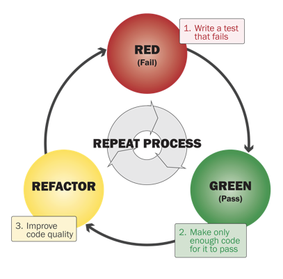
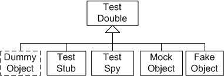
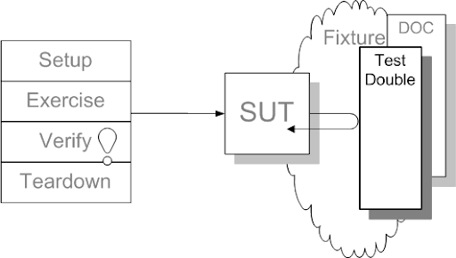

# TDD - Working with Test Doubles 

---

## Agenda
 - What do we remember
 - Test Doubles - What? Why?
     + Dummy
     + Stub
     + Spy
     + Mock
     + Fake

---

## What do we remember? 
 <!-- .element: height="400px" -->

---

## Test Doubles - What? Why?
 <!-- .element: height="400px" -->

---

## Test Doubles - What? Why?
Test doubles usage will only be possible if we use Dependency Injection practices or a DI framework (like Spring). Otherwise, will have to do **dark** practices, like **Whitebox Testing**

---

## Test Doubles - What?
A test double allows us to test our **SUT** (System Under Test) through component replacement (DOC: Depended-on Component).

 <!-- .element: height="400px" -->

---

## Test Doubles - Why?
 - Because we have an untested requirement that we need to verify and either **SUT** as **DOC** don’t provide an **observation point**
 - Because we have untested code and **DOC** doesn’t provide a **control point** to exercise **SUT**
 - Because we have slow tests and we want to run them quicker and more frequently


---

## Test Doubles - Dummy
It’s the simplest of doubles. It’s used only to fill arguments for a method call, without worrying about implementation

```java
   
    @Test
    public void addCustomerWithDummyTest() {
        Customer dummy = mock(Customer.class);
        AddressBook addressBook = new AddressBook();
        addressBook.addCustomer(dummy);
        Assert.assertEquals(1, addressBook.getNumberOfCustomers());
    }

```
Don’t be fooled by the syntax. It’s the role what determines the **test double type**, not the keyword. In this case, this is a **Dummy**

---

## Test Doubles - Stub
Stub's role is to return controlled values to the tested object. 
<br>Here, PricingRepository is a **Stub**

```java
    
    @Test
    public void testGetHighestPricedTrade() {
        Price price1 = new Price(10);
        Price price2 = new Price(15);
        Price price3 = new Price(25);

        PricingRepository pricingRepository = mock(PricingRepository.class);
        when(pricingRepository.getPriceForTrade(any(Trade.class)))
            .thenReturn(price1, price2, price3); //Here our repository will return a list of prices. 
            //Repository is called from PricingService internally

        PricingService service = new SimplePricingService(pricingRepository);

        Price highestPrice = service.getHighestPricedTrade();

        assertEquals(price3.getAmount(), highestPrice.getAmount());
    }

```

---

## Test Doubles - Mock
Mocks are used to verify object’s behavior while a test is being executed. <br>
By behavior we mean the right methods and paths are exercised. <br>
This is different than what a Stub does, which is only provide results

---

## Test Doubles - Mock
While we had this pattern with a Stub:

```java
    
    when(customer.getSurname()).thenReturn(surname);

```

In a Mock we have the following:

```java

    verify(listMock).add(s);
```

---

## Test Doubles - Spy
A spy is a kind of complex object that allows to encapsulate a real object, so we can verify or modify its behavior.

```java

    @Spy
    List<String> listSpy = new ArrayList<>();

    @Test
    public void testSpyReturnsRealValues() {
        String s = "my string";
        listSpy.add(s);

        verify(listSpy).add(s);
        assertEquals(1, listSpy.size());
    }

```

---

## Test Doubles - Spy
In the previous example a Spy object is installed on a common List. However, now we can change its behavior.

```java

    @Test(expected=RuntimeException.class)
    public void testSpyReturnsStubbedValues() throws Exception {
        listSpy.add("my string");
        assertEquals(1, listSpy.size());

        //Here we're modifying behavior to force an exception over a real object
        when(listSpy.get(anyInt())).thenThrow(new RuntimeException());
        listSpy.get(0);
    }
```

---

## Test Doubles - Fake
**Fake** objects are usally complex and hand-made, with less features than a production object.<br> 
It’s very likely that they inherit or implement certain interface which will be used to exercise the system.<br>
They tend to provide much more features than any of the doubles we’ve seen.

 - Example? A “hand-made” in-memory database.

---

## Further readings

 - https://dzone.com/articles/test-doubles-mockito
 - http://xunitpatterns.com/Test%20Double%20Patterns.html
 - https://blog.pragmatists.com/test-doubles-fakes-mocks-and-stubs-1a7491dfa3da
