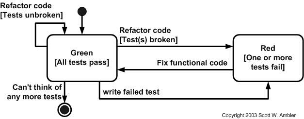

## TDD - Test Driven Development
Test-driven development (TDD) ([Beck 2003](http://www.amazon.com/exec/obidos/ASIN/0321146530/ambysoftinc); [Astels 2003](http://www.amazon.com/exec/obidos/ASIN/0131016490/ambysoftinc)), is an evolutionary approach to development which combines test-first development where you write a test before you write just enough production code to fulfill that test and [refactoring](http://www.agiledata.org/essays/databaseRefactoring.html).

---

## What is the primary goal of TDD? 
One view is: the goal of TDD is specification and not validation ([Martin, Newkirk, and Kess 2003](http://www.amazon.com/exec/obidos/ASIN/0135974445/ambysoftinc)). In other words, it’s one way to think through your requirements or design before your write your functional code (implying that TDD is both an important [agile requirements](http://www.agilemodeling.com/essays/agileRequirements.htm) and [agile design](http://www.agilemodeling.com/essays/agileDesign.htm) technique). Another view is that TDD is a programming technique. As Ron Jeffries likes to say, the goal of TDD is to write clean code that works.

---

## What is TDD?

The first step is to quickly add a test, basically just enough code to fail. Next you run your tests, often the complete test suite although for sake of speed you may decide to run only a subset, to ensure that the new test does in fact fail. You then update your functional code to make it pass the new tests. The fourth step is to run your tests again. 

---

If they fail you need to update your functional code and retest. Once the tests pass the next step is to start over (you may first need to refactor any duplication out of your design as needed, turning TFD into TDD).

---

## What is TDD? (In one picture)

 <!-- .element: height="400px" -->

---

## Testing via the xUnit framework
In our case, this will become the **JUnit Framework**

---

## Let's start with an excercise

Please go to [String calculator Kata](http://osherove.com/tdd-kata-1/), clone the base project from [Insert here repository]() and submit your code to the repository as a pull request
